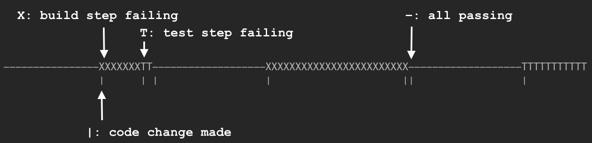

# timeline

`timeline` is a tool that shows a timeline of recent changes to your code, with indicators showing
the status of build and test steps.

# work

- test fsChangeSource recursion

- test fsChangeSource symlink behavior
